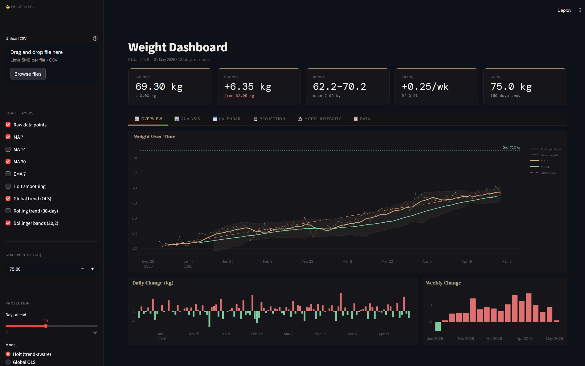
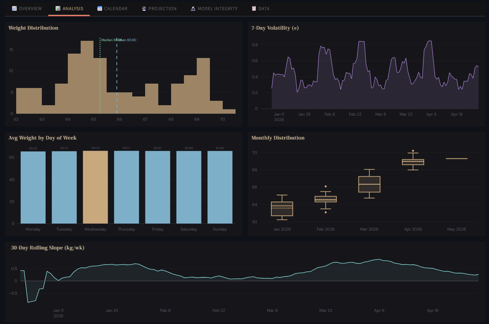
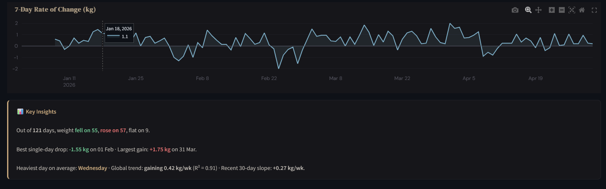
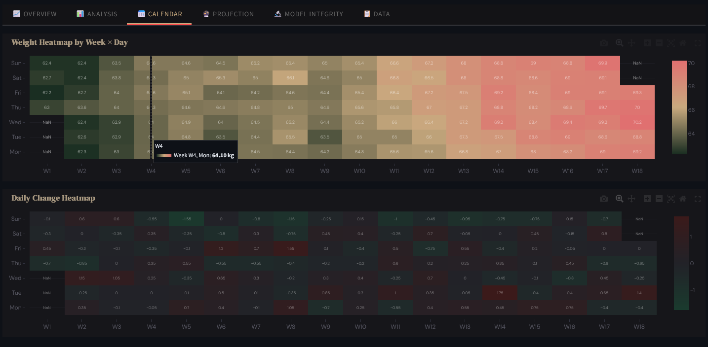
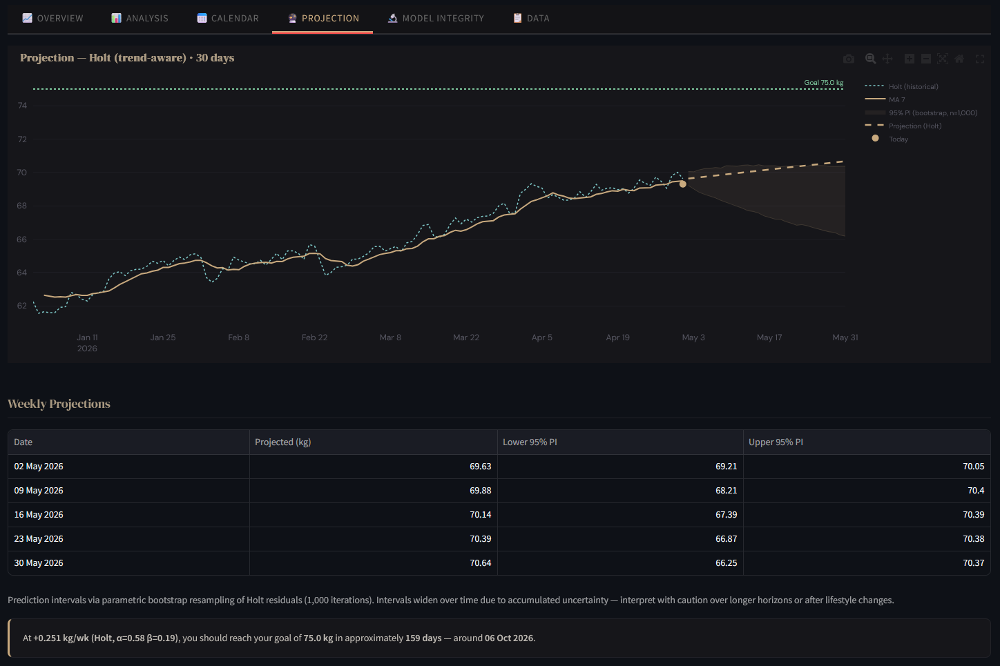
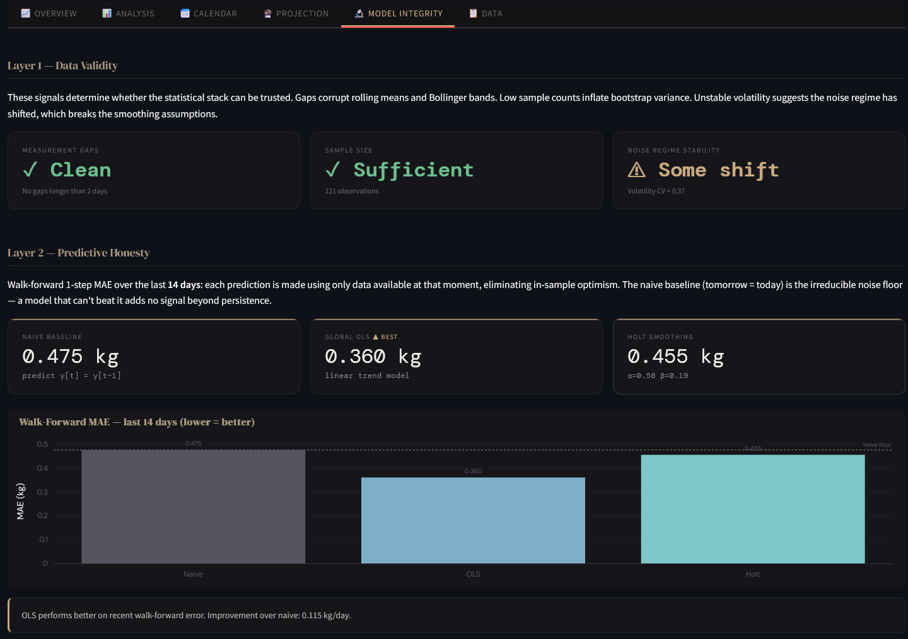
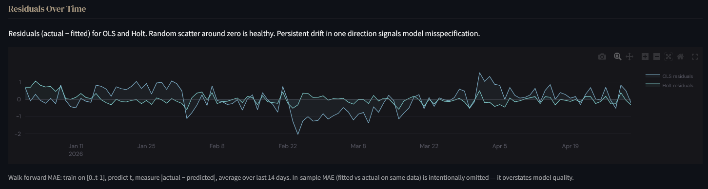

# 💪 Weight a Sec — Intelligent Weight Analytics Dashboard

A lightweight but powerful time-series analytics dashboard for tracking and forecasting body weight. This project combines statistical modeling, forecasting, and model evaluation into a single interactive system.

> I built this during National Service as a passion project to keep my brain running and monitor my bulking progress 🤣.

---

## 🚀 Live Demo

[](https://weightasec.streamlit.app/)
[](https://youtu.be/TyeTkq0-3Qg)
---

## 🧠 Overview

This project transforms simple weight logs into a structured analytics pipeline:

- Detects trends and regime shifts in noisy data
- Quantifies uncertainty in forecasts
- Evaluates models using walk-forward validation (no lookahead bias)
- Surfaces insights from noisy daily data

Rather than just tracking weight, it focuses on understanding the underlying signal.

---

## ✨ Features

### 📈 Overview
- Daily weight tracking with automatic delta computation  
- Moving averages (7 / 14 / 30-day)  
- Global trend (OLS regression)  
- Goal tracking with progress indicators  
- Bollinger bands & volatility context  

### 📊 Analysis
- Weight distribution & histogram views  
- Volatility tracking (rolling σ)  
- Weekly & monthly aggregation  
- Rolling slope (trend dynamics)  
- Rate-of-change analysis  

### 📅 Calendar
- Heatmaps of weight patterns (week × weekday)  
- Daily change visualization across time  

### 🔮 Projection
- Forecasting using:
  - Holt smoothing (adaptive trend)
  - OLS regression (long-term trend)  
- Bootstrap prediction intervals (95%)  
- Goal reachability estimation  

### 🔬 Model Evaluation & Reliability
- **Data Quality**
  - Missing data gap detection  
  - Sample size validation  
  - Noise regime stability  

- **Predictive Honesty**
  - Walk-forward MAE (no lookahead bias)  
  - Comparison vs naive baseline  

- **Residual Diagnostics**
  - Error tracking over time  
  - Detection of model drift / misspecification  

---

## 🎥 Demo

### 📌 Overview Dashboard


### 📊 Analytics View



### 📅 Heatmap View


### 🔮 Forecasting


### ✅ Model Integrity



---

## 📂 How to Use

### CSV Format

Upload a **CSV file** with the following structure `Date,Weight,Delta`:

```
Date,Weight,Delta
01/01/2026,62.95,-0.7
02/01/2026,62.25,0.45
...
```

- `Date` → required  
- `Weight` → required  
- `Delta` → optional (auto-computed if missing)

---

### File Constraints
- CSV only  
- Max file size: 5MB  
- Max rows: 5,000  

---

### Missing Data Handling
- Non-daily logs are supported  
- Data is treated as an **irregular time series**  
- Models infer underlying trends from available observations  

---

## 🔬 Deep Dive (How It Works)
> For a detailed breakdown of modeling decisions and implementation, see [`ARCHITECTURE.md`](./ARCHITECTURE.md)

### Layered Architecture
The system evaluates reliability in three layers:

1. **Data Quality**  
   Ensures sufficient and consistent input data  

2. **Model Performance**  
   Compares models against a naive baseline  

3. **Residual Diagnostics**  
   Analyses model errors over time  

---

### Forecasting Approach

- **Holt’s Model**  
  Captures level + trend dynamically  

- **OLS Regression**  
  Models long-term linear drift  

- **Bootstrap Simulation**  
  - Resamples residuals  
  - Simulates future paths  
  - Produces 95% prediction intervals  

---

### Model Evaluation

- Walk-forward validation:  
  `train [0..t-1] → predict t`  

- Prevents lookahead bias  
- Provides realistic performance estimates  
- Benchmarked against naive persistence  

---

## ⚙️ Tech Stack & Design Philosophy

### Tech Stack
- Python 3.10+
- Streamlit  
- Pandas / NumPy  
- SciPy  
- Plotly  

---

### Design Principles

**1. Signal > Noise**  
Weight data is noisy — models focus on extracting trend, not overfitting fluctuations  

**2. No Fake Precision**  
Prediction intervals replace single-line forecasts  

**3. Honest Evaluation**  
Models must beat the naive baseline to be meaningful  

**4. Defensive Engineering**
- File size & row limits  
- Column auto-detection  
- Safe parsing (utf-8 → fallback)  
- Injection-safe export handling  

---

## 🔐 Security & Safety

- File size & row limits (DoS protection)  
- CSV injection prevention  
- HTML escaping for user inputs  
- Safe numeric coercion (`errors="coerce"`)  
- Controlled fallback dataset system  

---

## ⚠️ Limitations

- No authentication or persistent storage  
- Data is session-based only  
- Not intended for medical use  
- Forecasts are statistical estimates, not guarantees  

---

## 🤝 Contributing

Contributions are welcome:

- ⭐ Star the repo  
- 🔧 Submit pull requests  
- 💬 Reach out for collaboration  

---

## 📜 License

MIT License — free to use, modify, and build upon  


